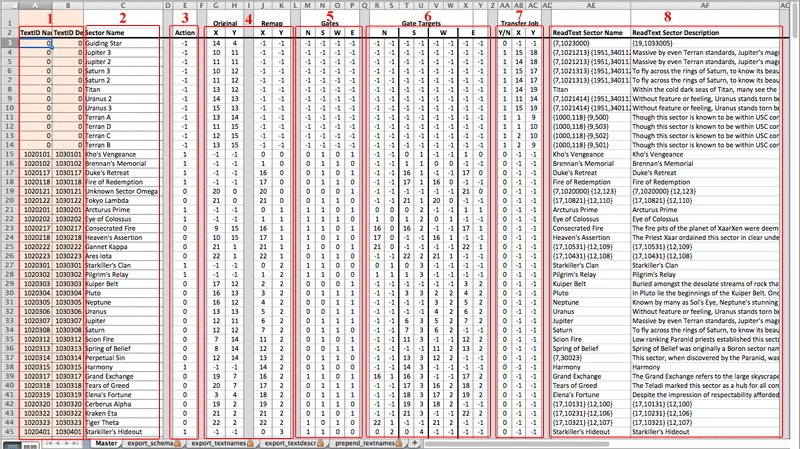

Guide to using X3 Map Surgeon
=============================
##A Step-by-step overview

###1. Develop your new map layout using RemapSchemaEditor

The Excel spreadsheet RemapSchemaEditor is the primary tool you will use to plan out your new galaxy map. All changes you make to the spreadsheet are on the Master worksheet, shown in Figure 1. This spreadsheet consists 8 sections of interest:

1. ReadText IDs (Do Not Change)
2. Sector Name
3. Remap Action
4. Sector Coordinates (Original and Remap)
5. Gates
6. Gate Targets
7. Transfer Sector Jobs to New Sector? (Y/N, New Coordinates)
8. ReadText Sector Names and Descriptions

**ReadText IDs**: These are auto-calculated based on the Remap Sector Coordinates. You do not make any changes to these values.

**Sector Name**: These are the sector names in readable format, which may differe from how they must be formatted in the generated ReadText file.

**Action**: Flag indicating what action is to be taken for each sector:

    -1 : Delete
     0 : Keep / Reassign to new coordinates
     1 : Add new to map

**Sector Coordinates**: The original sector coordinates and new coordinates. (-1 represents N/A, when sector coordinates don't make sense.)

**Gates**: Flag for each possible gate in a sector, N, S, W, and E. 0 means no sector to be placed in this position, 1 indicates a sector is to be placed.

**Gate Targets**: For each gate position, list the target sector the gate will be linked to. Most gates connect to contiguous neighbors, but this section allows sectors to be linked to distant sectors across the map. Certain rules are maintained:

* Gates always connect to gates in corresponding cardinal directions; N to S, S to N, W to E, etc.
* Only one gate can be connected to any other gate.
* If a gate targets a sector, there must be a gate in the correct position that receives that connection and connects back to the first gate.
    
**Transfer Jobs**: Normally, during the remap procedure, Jobs assigned to specific home sectors are reassigned to the new sector coordinates in the remap. In some situations you may need to transfer the Job to a new sector rather than let the automatic reassignment occur. Usually, this is because a Job is assigned to a sector that will be removed and replaced by a new sector. These fields allow you to flag the jobs assigned to this sector to be transferred to that new sector coordinate even if this sector is flagged for deletion.

**ReadText Sector Names and Descriptions**: These are the actual values used in generating the new ReadText file.

###2. Save the Remap Schema Editor.

You only need to save the Excel spreadsheet itself. The *Map Surgeon* utilities directly access the data in the spreadsheet.

###3. Use the X3 Galaxy Editor to create the new sectors

*Map Surgeon* cannot assist with designing and creating new sectors and their contents. At this time, you must continue to use the in-game Galaxy Editor to design and export these new sectors. However, *Map Surgeon* can make this process a little easier by rearranging the original sectors into your new map layout and exporting the map and support files into the game. Then by loading the new galaxy map in the Galaxy Editor, you only need to create the new sectors you wish to add, and connect their gates to the rest of the galaxy.

Once you have completed the design of your new galaxy map, export the map to disk. The *Map Surgeon* utilities will then help with generating the final schema files needed to speed up future map version updates.

###4. Copy the exported reference map to *mapsurgeon\input*.

Use *gen_newsectors.py* and *gen_gateschema.py* to extract the new sectors and gates schema data into *input\newsectors.xml* and *input\gate_schema.xml*.

###5. Generate new map and support files

Use *remap_cli.py* to generate the redesigned galaxy map, *gen_jobs.py* for the Jobs file, and *gen_readtext.py* for the ReadText file. Once these files have been generated, you will need to load them into the game for validation--to make sure everything was converted correctly.

###6. Generating a new objects\cut\00749.bod file

The 00749.bod file contains the animation data used by X3 to display the galaxy map in-game. Until you generate a new version of this file and restart your game, the in-game galaxy map will not display the sectors or gate connections correctly. Fortunately, Litcube has written a script that can generate the data for this file. It is included in Litcube's Universe and is available for vanilla X3 through the forums: [Litcube's Flat Map Script](http://forum.egosoft.com/viewtopic.php?t=261078).

In LU, the script is named "Z.Make00749Bod.xml", and in the standalone script package, "Lib.Debug.Make00749Bod.xml". Highlight the script in the in-game script editor, and press 'r' to run. Press 'Enter' twice to accept the default arguments and wait. If you have Subtitles enabled, you will see a progress report at the bottom of the screen. Once the export has completed, quit the game and browse to 'My Documents\Egosoft\X3AP' and locate the 8112.log file. Rename the log file to '00749.bod' and copy it to '<X3 game folder>\objects\cut'.

So long as your new map doesn't have any errors (like bad gate connections), the in-game galaxy map will now display your new map correctly.

